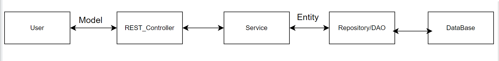

# Employee Management API

This is a rest API application built using **Spring Boot**, **Spring Data JPA**, and **MySQL**. It allows managing employee records, including creating, reading, updating, and deleting employee data. The application uses a MySQL database to store employee information.

---

### 1. Technologies Used

---

- Java
- Spring Boot
- Spring Data JPA
- Spring Web
- MySQL
- Lombok

---

### 2. Getting Started

---

To run this application locally, you'll need a Java Development Environment (JDK), MySQL server, and an IDE (e.g., VS-Code, Eclipse).

1. Clone the repository or download the source code.
2. Import the project into your preferred Java IDE.
3. Set up a MySQL database and update the database connection details in `application.properties`.
4. Build and run the application.
5. The application will be accessible at `http://localhost:8080/api/v1/employees`.

---

### 3. Project Structure and Code

---



- `EmployeeController.java`: The controller class that handles HTTP requests for employee operations.

_[src/main/java/com/example/employeeproject/Controller/EmployeeController.java](src/main/java/com/example/employeeproject/Controller/EmployeeController.java)_

```java
package com.example.employeeproject.Controller;

import java.util.List;

import org.springframework.beans.factory.annotation.Autowired;
import org.springframework.web.bind.annotation.CrossOrigin;
import org.springframework.web.bind.annotation.DeleteMapping;
import org.springframework.web.bind.annotation.GetMapping;
import org.springframework.web.bind.annotation.PathVariable;
import org.springframework.web.bind.annotation.PostMapping;
import org.springframework.web.bind.annotation.PutMapping;
import org.springframework.web.bind.annotation.RequestBody;
import org.springframework.web.bind.annotation.RequestMapping;
import org.springframework.web.bind.annotation.RestController;

import com.example.employeeproject.Model.Employee;
import com.example.employeeproject.Service.EmployeeService;
import com.example.employeeproject.Service.EmployeeServiceImp;

@CrossOrigin("http://localhost:3000")
@RestController
@RequestMapping("/api/v1")
public class EmployeeController {
    // This is the work of Service class
    // List<Employee> employees = new ArrayList<>();

    // If we dont want to use this
    // EmployeeService employeeService = new EmployeeServiceImp();
    // Dependency injection
    // @Autowired
    // EmployeeService employeeService;

    private final EmployeeService employeeService;

    @Autowired
    public EmployeeController(EmployeeService employeeService) {
        this.employeeService = employeeService;
    }

    @GetMapping("employees")
    public List<Employee> getAllEmployees() {

        // This is the work of Service class
        // Employee employee = new Employee();
        // employee.setName("Lodhi");
        // employees.add(employee);

        // list of employees
        return employeeService.readEmployees();
    }

    @GetMapping("employees/{id}")
    public Employee getEmployee(@PathVariable Long id) {
        return employeeService.readEmployee(id);
    }

    @PostMapping("employees")
    public String createEmployee(@RequestBody Employee employee) {
        // This is the work of Service class
        // employees.add(employee);
        return employeeService.createEmployee(employee);
    }

    @DeleteMapping("employees/{id}")
    public String deleteEmployee(@PathVariable Long id) {
        if (employeeService.deleteEmployee(id)) {
            return "Delete successfully";
        } else {
            return "Delete failed";
        }
    }

    @PutMapping("employees/{id}")
    public String updateEmployee(@PathVariable Long id, @RequestBody Employee employeeEntity) {
        return employeeService.updateEmployee(employeeEntity, id);
    }
}
```

- `EmployeeEntity.java`: The entity class representing the employee data in the database.

_[src/main/java/com/example/employeeproject/Entity/EmployeeEntity.java](src/main/java/com/example/employeeproject/Entity/EmployeeEntity.java)_

```java
package com.example.employeeproject.Entity;

import jakarta.persistence.Entity;
import jakarta.persistence.GeneratedValue;
import jakarta.persistence.GenerationType;
import jakarta.persistence.Id;
import jakarta.persistence.Table;
import lombok.Data;

@Data
@Entity
@Table(name = "emp_db")
public class EmployeeEntity {

    @Id
    @GeneratedValue(strategy = GenerationType.IDENTITY)
    private Long id;
    private String name;
    private String phone;
    private String email;
}
```

- `Employee.java`: The model class representing the employee data in the application.

_[src/main/java/com/example/employeeproject/Model/Employee.java](src/main/java/com/example/employeeproject/Model/Employee.java)_

```java
package com.example.employeeproject.Model;

import lombok.AllArgsConstructor;
import lombok.Data;
import lombok.NoArgsConstructor;

@Data
@NoArgsConstructor
@AllArgsConstructor
public class Employee {
    private Long id;
    private String name;
    private String phone;
    private String email;
}
```

- `EmployeeRepository.java`: The repository interface for interacting with the employee data in the database.

_[src/main/java/com/example/employeeproject/Repository/EmployeeRepository.java](src/main/java/com/example/employeeproject/Repository/EmployeeRepository.java)_

```java
package com.example.employeeproject.Repository;

import org.springframework.data.jpa.repository.JpaRepository;
import org.springframework.stereotype.Repository;

import com.example.employeeproject.Entity.EmployeeEntity;

@Repository
public interface EmployeeRepository extends JpaRepository<EmployeeEntity, Long> {

}
```

- `EmployeeService.java`: The service interface defining methods for employee operations.

_[src/main/java/com/example/employeeproject/Service/EmployeeService.java](src/main/java/com/example/employeeproject/Service/EmployeeService.java)_

```java
package com.example.employeeproject.Service;

import java.util.List;

import com.example.employeeproject.Model.Employee;

// Service is for business logic
public interface EmployeeService {
    String createEmployee(Employee employee);

    List<Employee> readEmployees();

    Employee readEmployee(Long id);

    boolean deleteEmployee(Long id);

    String updateEmployee(Employee employee, Long id);
}

```

- `EmployeeServiceImp.java`: The implementation of the `EmployeeService` interface.

_[src/main/java/com/example/employeeproject/Service/EmployeeServiceImp.java](src/main/java/com/example/employeeproject/Service/EmployeeServiceImp.java)_

```java
package com.example.employeeproject.Service;

import java.util.ArrayList;
import java.util.List;

import org.springframework.beans.BeanUtils;
import org.springframework.beans.factory.annotation.Autowired;

import com.example.employeeproject.Entity.EmployeeEntity;
import com.example.employeeproject.Model.Employee;
import com.example.employeeproject.Repository.EmployeeRepository;

public class EmployeeServiceImp implements EmployeeService {
    @Autowired
    private EmployeeRepository employeeRepository;

    // List<Employee> employees = new ArrayList<>();

    @Override
    public String createEmployee(Employee employee) {

        // Convert model into Entity
        EmployeeEntity employeeEntity = new EmployeeEntity();
        BeanUtils.copyProperties(employee, employeeEntity);

        employeeRepository.save(employeeEntity);
        // employees.add(employee);
        return "Saved Successfully";
    }

    @Override
    public Employee readEmployee(Long id) {
        EmployeeEntity employeeEntity = employeeRepository.findById(id).get();
        Employee employeeModel = new Employee();

        BeanUtils.copyProperties(employeeEntity, employeeModel);

        return employeeModel;
    }

    @Override
    public List<Employee> readEmployees() {
        List<Employee> employees = new ArrayList<>();
        List<EmployeeEntity> employeesList = employeeRepository.findAll();

        for (EmployeeEntity employeeEntity : employeesList) {
            Employee employee = new Employee();
            // get the important data from the entity and set it to the model
            employee.setId(employeeEntity.getId());
            employee.setName(employeeEntity.getName());
            employee.setPhone(employeeEntity.getPhone());
            employee.setEmail(employeeEntity.getEmail());
            employees.add(employee);
        }
        return employees;
    }

    @Override
    public boolean deleteEmployee(Long id) {
        // Do it like this or first find the entity with Id and delete it.
        // employeeRepository.deleteById(id);
        EmployeeEntity employeeEntity = employeeRepository.findById(id).get();
        employeeRepository.delete(employeeEntity);

        // employees.remove(id);
        return true;
    }

    @Override
    public String updateEmployee(Employee employee, Long id) {
        EmployeeEntity existingEmployeeEntity = employeeRepository.findById(id).get();

        existingEmployeeEntity.setName(employee.getName());
        existingEmployeeEntity.setPhone(employee.getPhone());
        existingEmployeeEntity.setEmail(employee.getEmail());

        employeeRepository.save(existingEmployeeEntity);
        return "Update Successfully";
    }
}
```

- `EmployeeProjectApplication.java`: The main class that initializes the Spring Boot application.

_[src/main/java/com/example/employeeproject/EmployeeProjectApplication.java](src/main/java/com/example/employeeproject/EmployeeProjectApplication.java)_

```java
package com.example.employeeproject;

import org.springframework.boot.SpringApplication;
import org.springframework.boot.autoconfigure.SpringBootApplication;
import org.springframework.context.annotation.Bean;

import com.example.employeeproject.Service.EmployeeService;
import com.example.employeeproject.Service.EmployeeServiceImp;

@SpringBootApplication
public class EmployeeProjectApplication {

	@Bean
	public EmployeeService employeeService() {
		return new EmployeeServiceImp();
	}

	public static void main(String[] args) {
		SpringApplication.run(EmployeeProjectApplication.class, args);
	}
}
```

---

### 4. API Endpoints

---

- `GET /api/v1/employees`: Retrieve a list of all employees.
  
- `GET /api/v1/employees/{id}`: Retrieve an employee by ID.
  
- `POST /api/v1/employees`: Create a new employee.
  
- `PUT /api/v1/employees/{id}`: Update an existing employee.
  
- `DELETE /api/v1/employees/{id}`: Delete an employee by ID.
  

---

---

### 6.Contributing

---

Contributions are welcome! If you find any issues or have suggestions for improvement, please open an issue or submit a pull request.

---

### 7.License

---

This project is licensed under the [MIT License](LICENSE).
